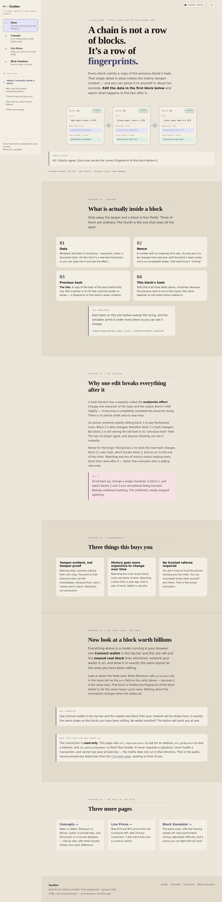
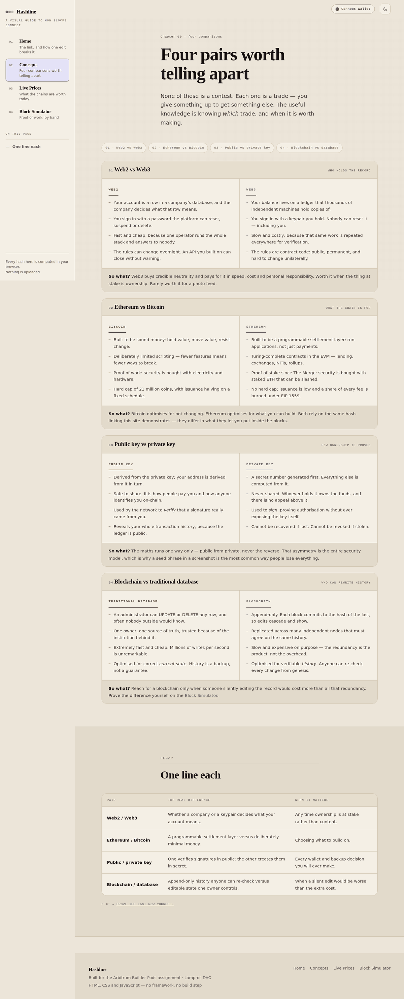
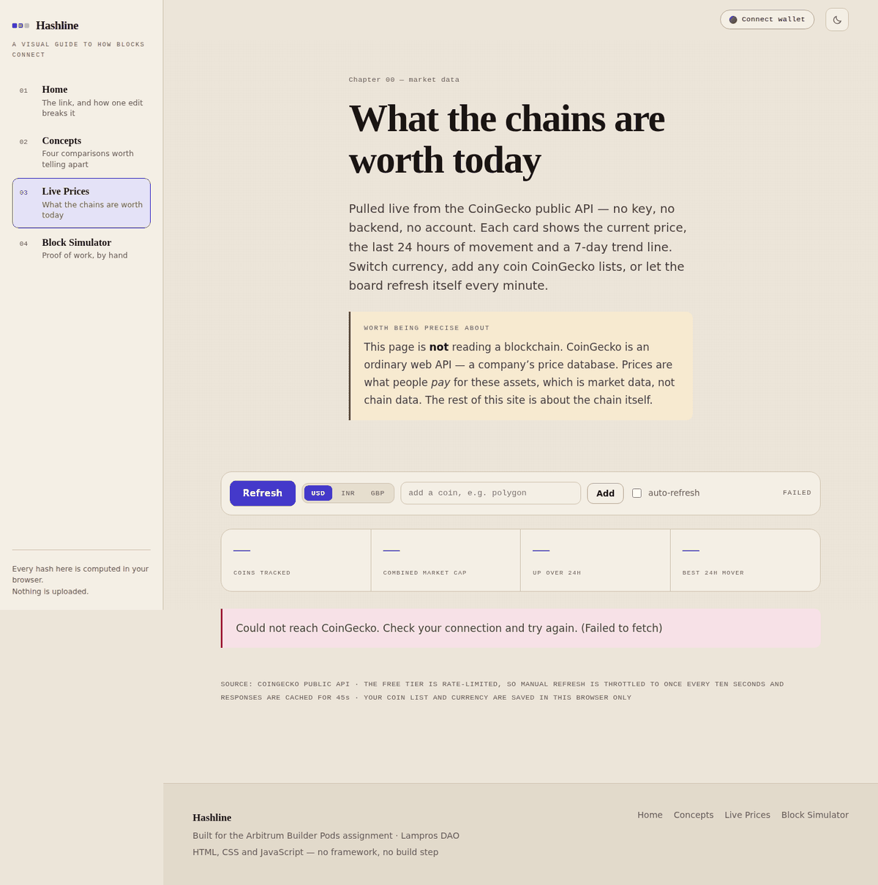
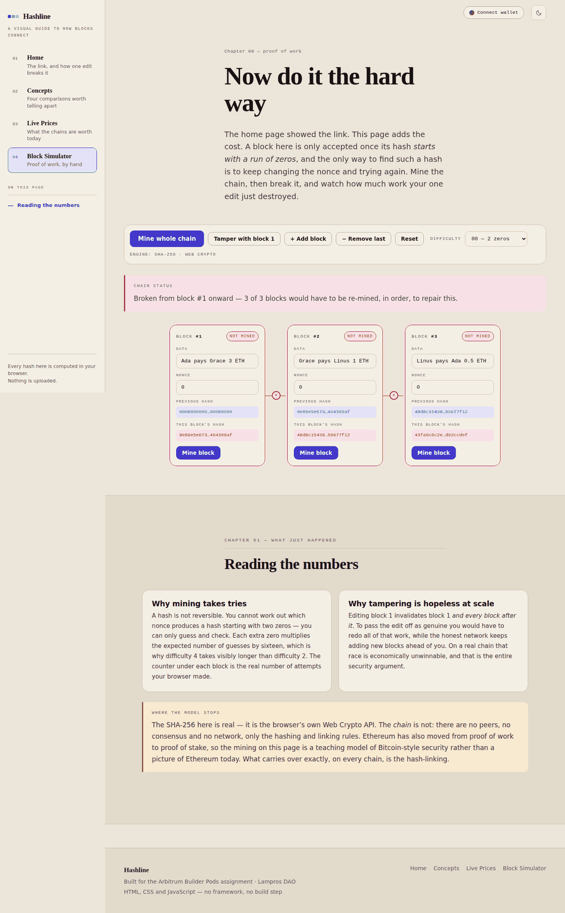

# Hashline — how blocks connect in a blockchain

A four-page website built for the **Arbitrum Builder Pods** assignment (Lampros DAO).
Theme: *visual representation of how blocks are connected in a blockchain*.

Everything on the site serves one sentence: **a blockchain is a chain because every block
stores a fingerprint of the one before it.** The landing page lets you break that link in
about ten seconds. The simulator makes you pay for it in proof-of-work.

Plain HTML, CSS and JavaScript. No framework, no build step, no dependencies.



---

## Pages

| # | File | What it does |
|---|------|--------------|
| 1 | `index.html` | Landing page. Opens with a **live three-block chain you can type into** — edit a block and the ones after it break instantly. Then five chapters: the anatomy of a block, why one edit cascades, what that buys you, **a real block pulled from your own connected wallet**, and where to go next. |
| 2 | `concepts.html` | Four side-by-side comparisons — Web2 vs Web3, Ethereum vs Bitcoin, public vs private key, blockchain vs traditional database — each closing with a plain-English "so what?", plus a one-line recap table. |
| 3 | `prices.html` | Live BTC / ETH / SOL / ADA prices from the CoinGecko public API: 24-hour movement with a green or red arrow, a 7-day trend line, market cap, currency switching, coin search and optional auto-refresh. |
| 4 | `simulator.html` | The same chain component with the training wheels off: real SHA-256 proof-of-work mining, adjustable difficulty, an editable nonce, and add/remove blocks. Mine it, tamper with block 1, and see how much work you just destroyed. |

All four pages share one masthead, one stylesheet and one visual language. The current page
is marked with `aria-current="page"` in the sidebar, which is always open on desktop and
slides in below 1080px (see below).

| Concepts | Live prices | Block simulator |
|---|---|---|
|  |  |  |

---

## The idea, in one section

A hash function turns any text into 64 hex characters. Two properties matter:

- **Deterministic** — the same input always gives the same output.
- **Avalanche** — change one character and the output is *completely* unrelated, not
  slightly different.

Each block on this site commits to exactly this string:

```
index=2|data=Grace pays Linus 1 ETH|prev=a3f9…|nonce=0
```

Because `prev` is one of the inputs, block 2's hash depends on block 1's hash, which depends
on everything before it. Edit block 1 and its hash changes — but block 2 is still storing the
*old* value in its `prev` field. They no longer agree, and anyone can see it.

### The subtle part, which the site makes visible

When you edit block 1 on the landing page, **block 1 stays green**. Only blocks 2 and 3 turn
red. That is not a bug, and it is the most interesting thing on the page: a tampered block is
perfectly self-consistent. Nothing about it looks wrong in isolation. You catch the forgery
only because the *next* block stopped agreeing with it. Verification is relational, not local.

---

## Project structure

```
hashline/
├── index.html              # Page 1 — landing, with the live editable chain
├── concepts.html           # Page 2 — four comparisons + recap table
├── prices.html             # Page 3 — live CoinGecko dashboard
├── simulator.html          # Page 4 — proof-of-work simulator
├── assets/
│   ├── css/
│   │   └── hashline.css    # one stylesheet, shared by all four pages
│   └── js/
│       ├── core.js         # pure logic: commitment, break detection, formatting
│       ├── ui.js           # theme, sidebar, scroll progress, scrollspy, reveal
│       ├── chain.js        # the reusable chain component (3 modes)
│       ├── wallet.js       # EIP-1193 wallet connect + the real-block panel
│       └── prices.js       # CoinGecko fetching, trend lines, search, currency
├── tests/
│   └── core.test.js        # 26 unit tests, Node's built-in runner, no deps
├── tools/
│   └── contrast-check.js   # WCAG AA audit of the colour tokens
├── .github/workflows/
│   └── ci.yml              # tests + contrast audit + broken-reference check
├── screenshots/            # one per page
├── package.json            # dev scripts only — the site has no build step
└── README.md
```

### One component, two pages

`chain.js` is written once and used three ways, which is why the landing page and the
simulator feel like one idea at two depths rather than two unrelated widgets:

| Mode | Used on | Behaviour |
|---|---|---|
| `demo` | home | Edit any block's data. Hashes recompute instantly, no mining — the only lesson is the link. |
| `full` | simulator | Proof-of-work mining, difficulty selector, editable nonce, add/remove blocks. |
| `static` | available | A frozen diagram, no inputs. |

**The one design decision worth calling out:** a block's `prev` field is *stored data*, never
recalculated. An early version of this project recomputed it on every pass, which quietly
re-linked the chain behind the user so nothing ever appeared broken. A browser test caught it.
Letting the stored value go stale is precisely what a broken link *is*.

---

## Navigation and the wallet

### An always-open rail, not a hidden menu

Navigation is a **permanent sidebar** down the left edge. Above 1080px it is simply always there
and the page is inset to make room; below that the same element slides in over the content and a
hamburger appears. One piece of markup, two behaviours, no duplicated nav.

Three things animate while you scroll, all driven by a single rAF-throttled handler:

| | |
|---|---|
| **Progress line** | A gradient fills down the rail's right edge as you move through the page. |
| **Sliding pill** | An indicator glides between nav items — it chases whatever you hover or focus, then settles back on the page you're actually reading. |
| **On this page** | A contents list built *from the document itself* at load: the script walks `main section`, takes each `h2`, generates an id if the markup lacks one, and highlights whichever section you're currently in. |

Because the contents list is generated rather than hand-written, it can never fall out of sync
with the page — add a section and it appears on its own.

The nav items also fan in on load with a stagger. All of it is disabled under
`prefers-reduced-motion`.

Keyboard behaviour is preserved below 1080px, where the rail behaves as a panel: opening moves
focus inside, <kbd>Esc</kbd> closes and returns focus to the button, and a focus trap keeps
<kbd>Tab</kbd> within it. Crossing the breakpoint resets the state so a half-open panel can never
be stranded.

### The wallet, and why this site has one

`assets/js/wallet.js` uses **no wallet library** — no ethers, no web3, no wagmi. A wallet
extension injects one object at `window.ethereum` exposing a single method, and every interaction
here is that method with a different name:

| Method | Used for |
|---|---|
| `eth_requestAccounts` | prompt the user to connect |
| `eth_accounts` | silently reconnect a returning visitor — never prompts |
| `eth_chainId` | detect which network the wallet is on |
| `eth_getBalance` | read the account balance |
| `eth_blockNumber` | the height of that chain right now |
| `eth_getBlockByNumber` | fetch a real block header |

The wallet is not decoration. Everything else on this site asks you to trust a *simulated* chain.
Connecting a wallet lets the page pull the **newest real block** from whichever network you are
on and draw it in exactly the same card layout as the simulated ones. Ethereum's `parentHash`
lands in the same slot as the `prev` field you have been editing all along — because it is the
same idea. Nothing about the mechanism changes when the stakes do.

**Strictly read-only.** No signature is ever requested, no transaction is ever built, and the site
cannot see a private key — the maths does not run in that direction. That is the public-versus-
private-key comparison on the Concepts page, demonstrated rather than asserted.

---

## Run it locally

Everything is static, so there is nothing to install:

```bash
git clone <your-repo-url>
cd hashline
python -m http.server 5501     # then open http://localhost:5501
```

or use the **Live Server** extension in VS Code and click *Go Live*.

Opening `index.html` directly by double-clicking also works, but serving over HTTP is better:
`crypto.subtle` (real SHA-256) is only available in a secure context. On `file://` the site
falls back to a non-cryptographic hash and **says so** in the toolbar rather than pretending.

---

## Quality checks

Both scripts run on Node's standard library, so neither needs `npm install` — which is why CI
has nothing to install and nothing that can break from a bad dependency.

```bash
npm test          # 26 unit tests against assets/js/core.js
npm run contrast  # WCAG 2.1 AA audit of every colour token, both themes
npm run check     # both
```

`core.js` holds every pure function — the commitment string, break detection, damage counting,
the fallback hash, money and percentage formatting, trend-line geometry. No DOM, no network, no
clock, which is what makes it testable.

**The tests found three real bugs during development**, which is the honest argument for writing
them:

1. `weakHash` was emitting values like `-2c418e16…` — JavaScript's `^` operator works on
   *signed* 32-bit integers, so without forcing back to unsigned the value went negative and
   `toString(16)` prefixed a minus sign. It wasn't valid hex at all.
2. The browser test caught the `prev`-recalculation bug described above, where the cascade
   silently never happened.
3. A browser check caught the wallet chip hiding its *only* text label at narrow widths, leaving
   an unlabelled dot with no affordance. The wordmark now yields on small screens instead, and the
   chip carries an explicit `aria-label` in every state so its accessible name never depends on
   what CSS happens to paint.

`tools/contrast-check.js` parses the colour tokens straight out of `hashline.css`, so the audit
can never drift from the real stylesheet, and exits non-zero on a failure.

---

## Design system

Colour is never decorative here. Four tokens name the four things a reader has to keep straight:

| Token | Means |
|---|---|
| `--data` amber | the payload a human typed into a block |
| `--hash` indigo | a fingerprint the machine computed |
| `--linked` green | this block's link to its predecessor is intact |
| `--broken` rose | the link is broken |

That rule holds on every screen — the block cards, the connectors between them, the comparison
columns, the price arrows. Type is Fraunces for display, Public Sans for reading, IBM Plex Mono
for anything a machine produced.

**There is no pure white anywhere in the light theme.** A white card on a white page is the main
source of glare on a bright screen, so the lightest surface here sits at about 87% luminance —
the page reads like paper under a lamp rather than a lightbox. Dimming the paper pushed three
text tokens below AA, which `npm run contrast` caught immediately; they were retuned rather than
shipped. Light is the default because this is a site you *read*; the toggle switches to dark and
the choice is remembered.

---

## Accessibility

- Every colour token meets **WCAG 2.1 AA (4.5:1)** against every surface it appears on, in both
  themes — verified by `npm run contrast`, not by eye.
- Skip link on every page; visible focus ring throughout.
- The nav collapses to a labelled button under 780px, closes on <kbd>Esc</kbd>, and stays fully
  visible with JavaScript disabled rather than becoming unreachable.
- Scroll reveal, price flashes and the mining animation all respect `prefers-reduced-motion`.
- Live regions announce the chain verdict and price updates to screen readers.
- The recap table scrolls inside its own container instead of forcing the page sideways.

---

## Known issues and what I'd improve

- **CoinGecko rate limits.** The free tier allows only a handful of calls a minute. Responses
  are cached in `sessionStorage` for 45 seconds and manual refresh is throttled to once every
  ten, but hammering it can still return HTTP 429. The page reports that plainly and does *not*
  retry, because a retry would hit the same wall and spend another call.
- **The masthead and footer are duplicated across all four HTML files.** This is the real
  structural weakness: changing a nav link means four edits. The fix is a small static build
  with a shared layout — deliberately not done, because "no build step" is currently a feature.
- **Mining is fast but not instant.** Hashing runs 1,024 candidates at a time and yields
  between batches; the whole chain is mined at difficulty 4 in about three seconds. A Web Worker
  would take it off the main thread entirely.
- **Nothing persists.** Your theme and coin list survive a reload; the chain resets. Deliberate
  for a teaching page, but saving it would be a short addition.
- **The simulated chain is still a model.** The SHA-256 is genuine, but there are no peers, no
  consensus and no network. The site says so on the simulator page rather than implying
  otherwise. The wallet panel on the home page is the counterweight: that block is real.
- **The wallet is read-only, by design.** No signing, no transactions. The natural next step is a
  single write transaction on a testnet — building it, signing it, waiting for the receipt — which
  would show the other half of what a keypair is for.
- **Without a wallet extension the real-block panel shows a prompt**, not an error. That is the
  intended state, not a failure.

---

## Author

Built for the Arbitrum Builder Pods programme, Lampros DAO.
